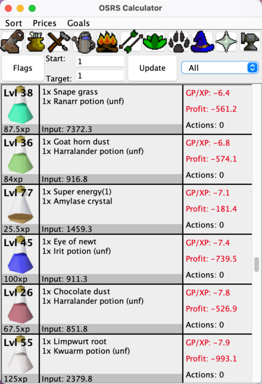

## OSRSCalculator
OSRSCalculator is an efficiency focused calculator written in Java for OldSchool RuneScape. <br>
Prices are fetched from the [OSRS Wiki](https://oldschool.runescape.wiki/), with their 
[Real-time Prices API](https://oldschool.runescape.wiki/w/RuneScape:Real-time_Prices).

## Latest Release
The latest version can be found in the [releases](https://github.com/Matthew-nop/OSRSCalculator/releases) page. <br>
This project is still in a very early beta, with many features/skills not implemented yet and many bugs left to be ironed out.

## Features
 - Real-time prices fetched from the [OSRS Wiki](https://oldschool.runescape.wiki/)
 - Sort recipes by required level, GP/XP, profit/action, or alphabetically
 - Compare training options that all utilise the same method 
 - Flags for special equipment effects such as the amulet of chemistry
 - Cross-platform and portable
 - Manually enter prices for recipes so you can check your own outputs (in a future release)




## Build Requirements
You will need to have Java (JDK 21 or newer) installed on your machine to run the .jar file or build the project. <br>
You will need maven if you want to build the project.

## Building
To build a .jar file, in the project root directory run the following commands:
```
mvn clean package
```
The output file jar be located at `out/OSRSCalculator-jar-with-dependencies.jar`

## File Layout
 - src/main/java
   - source directory
 - src/main/resources
   - resources directory
   - `Flags/*` and `Images/*` must have size <= 64x64
 - doc/
   - documentation directory
 - images/
   - contains all images used in the calculator in original size
